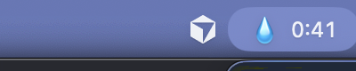
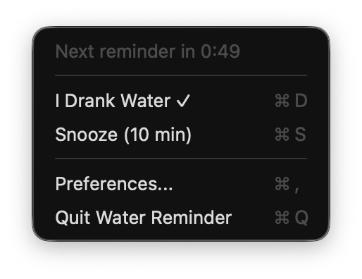
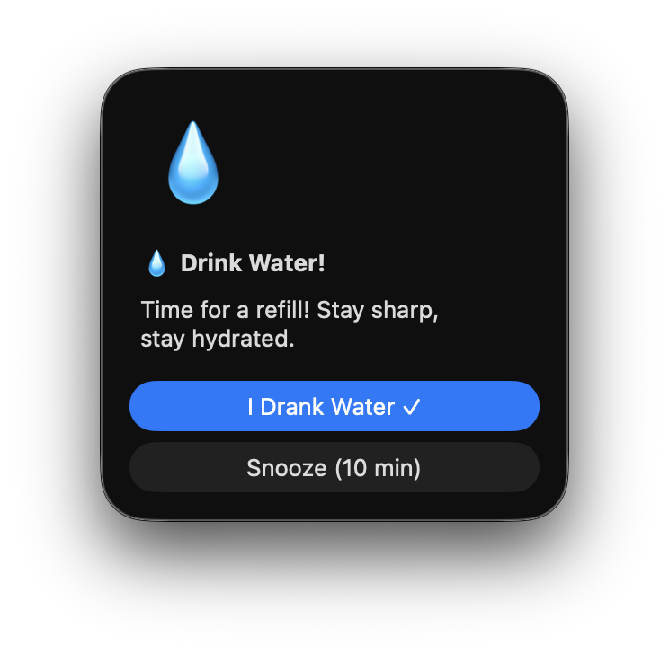
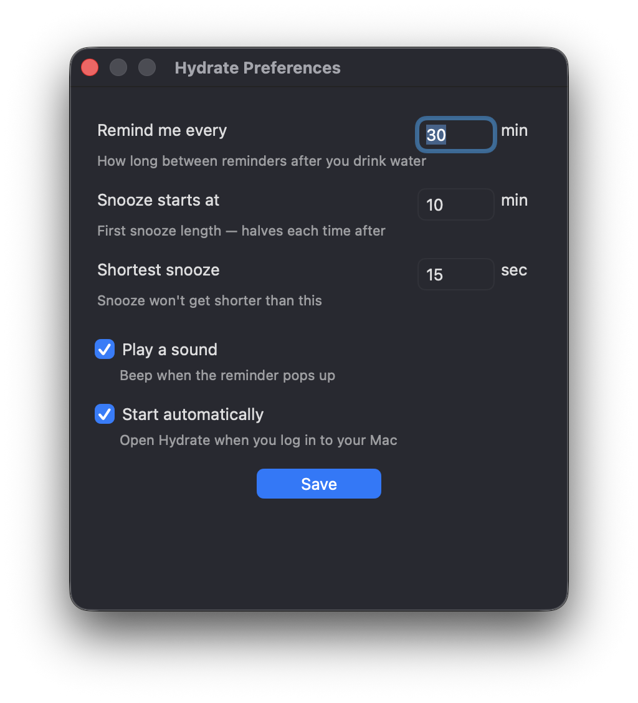

<p align="center">
  
</p>

<h1 align="center">Hydrate</h1>

<p align="center">
  A lightweight macOS menu bar app that reminds you to drink water.<br>
  Persistent. Annoying (in a good way). Open source.
</p>

<p align="center">
  <a href="https://github.com/parampatel21/hydrate/releases/latest"></a>
  <a href="LICENSE"></a>
  
  
</p>

---

## What is Hydrate?

Hydrate lives in your menu bar and reminds you to drink water every 30 minutes. If you snooze, it gets increasingly persistent — halving the reminder interval each time until you give in and hydrate.

It also detects when you open your laptop after a break and immediately reminds you to have some water.

**No Dock icon. No bloat. Just water reminders.**

## Screenshots

<p align="center">
  
  &nbsp;&nbsp;&nbsp;
  
</p>

<p align="center">
  
  &nbsp;&nbsp;&nbsp;
  
</p>

## Features

- **Menu bar countdown** — always see how long until your next reminder
- **Escalating snooze** — reminders come back at 10 min, then 5, then 2.5, then 1.25...
- **Wake detection** — reminds you when you open your laptop after sleep
- **Two-button dialog** — "I Drank Water" to reset, or "Snooze" to delay
- **Preferences** — customize intervals, sound, and launch-at-login
- **Lightweight** — native Swift, ~15 MB memory, near-zero CPU
- **No Dock icon** — lives entirely in the menu bar
- **Open source** — MIT licensed, single-file Swift source

## Installation

### Download (recommended)

1. Go to [**Releases**](https://github.com/parampatel21/hydrate/releases/latest)
2. Download `Hydrate.zip`
3. Unzip and drag `Hydrate.app` to your **Applications** folder
4. **Important — remove the quarantine flag** (the app isn't code-signed):
   ```bash
   xattr -cr /Applications/Hydrate.app
   ```
5. Open it — you'll see the water droplet in your menu bar

> **Why is this needed?** macOS quarantines apps downloaded from the internet that aren't signed with an Apple Developer certificate. The command above removes that flag. You can verify the source code right here in this repo. Alternatively, you can [build from source](#build-from-source) to avoid this entirely.

### Build from source

Requires macOS 13+ and Xcode Command Line Tools.

```bash
git clone https://github.com/parampatel21/hydrate.git
cd hydrate
make build
make install   # copies to ~/Applications
make run       # or just open ~/Applications/Hydrate.app
```

## How It Works

1. **Timer starts** — 30 minutes on the clock (configurable)
2. **Reminder fires** — a dialog pops up with two buttons
3. **"I Drank Water"** — resets the timer back to 30 minutes
4. **"Snooze"** — next reminder in 10 minutes
5. **Snooze again** — 5 minutes, then 2.5, then 1.25... it keeps halving
6. **Ignore for 2 min** — auto-snoozes (escalates)
7. **Open laptop from sleep** — immediate reminder

The menu bar always shows a live countdown so you know when the next reminder is coming.

## Preferences

Click the menu bar icon and select **Preferences...** to configure:

| Setting | Default | Description |
|---------|---------|-------------|
| Reminder interval | 30 min | Time between reminders after drinking |
| First snooze | 10 min | How long the first snooze lasts |
| Minimum snooze floor | 15 sec | Shortest possible snooze interval |
| Sound | On | Play a beep when the reminder fires |
| Launch at login | Off | Start Hydrate automatically on boot |

## Uninstall

1. Click the menu bar icon and select **Quit Water Reminder**
2. Delete `Hydrate.app` from your Applications folder
3. Optionally remove preferences: `defaults delete com.parampatel.waterreminder`

## Contributing

Contributions are welcome! Feel free to open issues or submit pull requests.

## License

[MIT](LICENSE) — do whatever you want with it.
